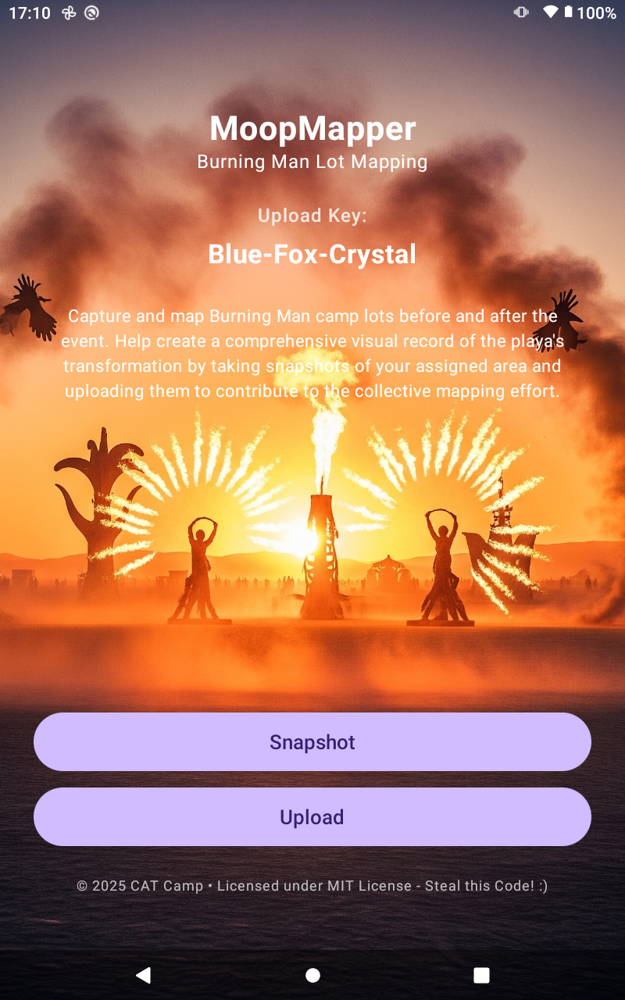

# MoopMapper

A mobile Android application for mapping Burning Man camp lots before and after the event. MoopMapper helps create a comprehensive visual record of the playa's transformation by allowing participants to capture and upload snapshots of their assigned areas.

## Overview


MoopMapper enables Burning Man participants to contribute to a collective mapping effort by:
- Taking photos of camp lots and areas before setup
- Capturing the same locations after teardown
- Uploading images with unique device identifiers for tracking
- Contributing to a larger dataset showing the playa's transformation

Each device generates a unique, human-readable upload key (e.g., "Red-Tiger-Mountain") that persists across app sessions and helps organize contributions.

## Features

- **Unique Device Identification**: Auto-generated three-word upload keys using adjectives, animals, and objects
- **Background Image Support**: Customizable launch screen with bg0.png background
- **Persistent Storage**: Upload keys are saved locally and reused across sessions
- **Clean Material 3 UI**: Modern Android design with Jetpack Compose
- **Ready for Extensions**: Placeholder functionality for snapshot and upload features

## Screenshots

*Add screenshots here showing the launch screen and key features*

## Technical Details

### Architecture
- **Platform**: Android (Kotlin)
- **UI Framework**: Jetpack Compose with Material 3
- **Storage**: SharedPreferences for persistent device ID
- **Build System**: Gradle with Kotlin DSL

### Key Components
- `MainActivity.kt`: Main launch screen with device ID generation and UI
- `bg0.png`: Custom background image for launch screen
- Three-word ID generation using curated word lists

### Upload Key Format
Upload keys follow the pattern: `Adjective-Animal-Object`
- 30 adjectives (colors and descriptors)
- 30 animals (various species)
- 30 objects (natural and man-made items)
- Total possible combinations: 27,000 unique keys

## Development

### Prerequisites
- Android Studio Arctic Fox or later
- Android SDK API level 21+
- Kotlin 1.8+

### Building
```bash
./gradlew assembleDebug
```

### Running
```bash
./gradlew installDebug
```

## Project Structure
```
app/
├── src/main/
│   ├── java/com/capricallctx/moopmapper/
│   │   ├── MainActivity.kt          # Main app logic and UI
│   │   └── ui/theme/               # Material 3 theming
│   ├── res/
│   │   ├── drawable/
│   │   │   └── bg0.png            # Launch screen background
│   │   └── values/                # App resources
│   └── AndroidManifest.xml
└── build.gradle.kts               # App build configuration
```

## Roadmap

### Planned Features
- [ ] Camera integration for lot snapshots
- [ ] GPS coordinate capture with images
- [ ] Image upload functionality
- [ ] Server integration for data collection
- [ ] Before/after comparison views
- [ ] Offline image storage and batch upload
- [ ] Area assignment and mapping tools

### Future Enhancements
- [ ] Integration with Burning Man's official mapping systems
- [ ] Real-time collaboration features
- [ ] Analytics and reporting dashboards
- [ ] Multi-event support beyond Burning Man

## Contributing

This project is designed to help the Burning Man community document and understand the event's environmental impact. Contributions are welcome!

1. Fork the repository
2. Create a feature branch
3. Make your changes
4. Submit a pull request

## License

Licensed under the MIT License. See LICENSE file for details.

## Contact

For questions about this project or Burning Man mapping initiatives, please open an issue in this repository.

---

*Built for the Burning Man community with ❤️*
